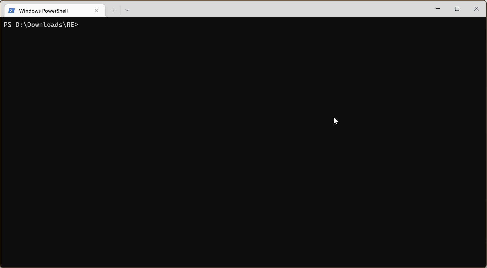
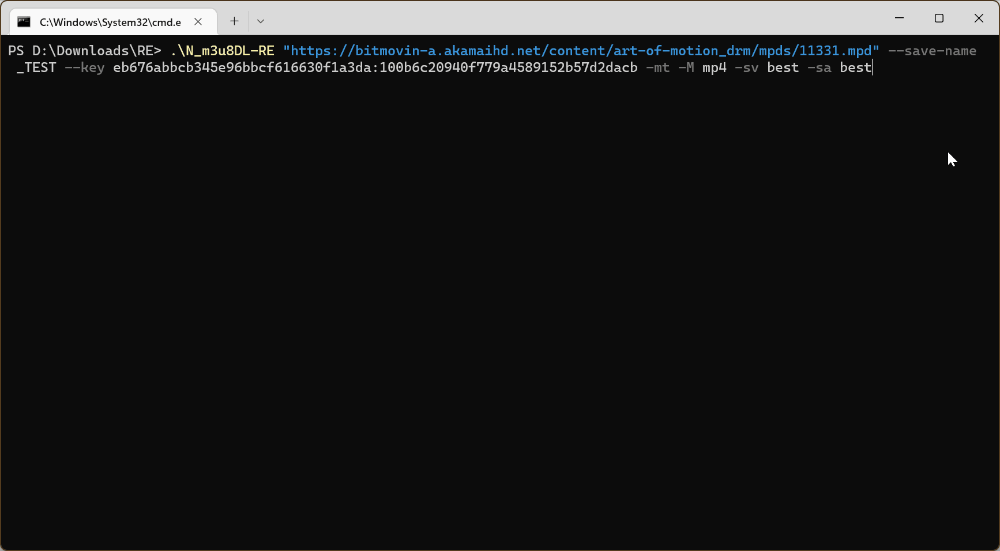

# N_m3u8DL-RE
跨平台的DASH/HLS/MSS下载工具。支持点播、直播(DASH/HLS)。

[](https://github.com/nilaoda/N_m3u8DL-RE)  [](https://github.com/nilaoda/N_m3u8DL-RE)  [](https://github.com/nilaoda/N_m3u8DL-RE/releases)  [](https://github.com/nilaoda/N_m3u8DL-RE)   [](https://github.com/nilaoda/N_m3u8DL-RE/releases)


遇到 BUG 请首先确认软件是否为最新版本（如果是 Release 版本，建议到 [Actions](https://github.com/nilaoda/N_m3u8DL-RE/actions) 页面下载最新自动构建版本后查看问题是否已经被修复），如果确认版本最新且问题依旧存在，可以到 [Issues](https://github.com/nilaoda/N_m3u8DL-RE/issues) 中查找是否有人遇到过相关问题，没有的话再进行询问。


---

版本较低的Windows系统自带的终端可能不支持本程序，替代方案：在 [cmder](https://github.com/cmderdev/cmder) 中运行。

Arch Linux 可以从 AUR 获取：[n-m3u8dl-re-bin](https://aur.archlinux.org/packages/n-m3u8dl-re-bin)、[n-m3u8dl-re-git](https://aur.archlinux.org/packages/n-m3u8dl-re-git)

```bash
# Arch Linux 及其衍生版安装 N_m3u8DL-RE 发行版
yay -Syu n-m3u8dl-re-bin

# Arch Linux 及其衍生版安装 N_m3u8DL-RE 开发版
yay -Syu n-m3u8dl-re-git
```
---

# 命令行参数
```
Description:
  N_m3u8DL-RE (Beta version) 20230628

Usage:
  N_m3u8DL-RE <input> [options]

Arguments:
  <input>  链接或文件

Options:
  --tmp-dir <tmp-dir>                      设置临时文件存储目录
  --save-dir <save-dir>                    设置输出目录
  --save-name <save-name>                  设置保存文件名
  --base-url <base-url>                    设置BaseURL
  --thread-count <number>                  设置下载线程数 [default: 16]
  --download-retry-count <number>          每个分片下载异常时的重试次数 [default: 3]
  --auto-select                            自动选择所有类型的最佳轨道 [default: False]
  --skip-merge                             跳过合并分片 [default: False]
  --skip-download                          跳过下载 [default: False]
  --check-segments-count                   检测实际下载的分片数量和预期数量是否匹配 [default: True]
  --binary-merge                           二进制合并 [default: False]
  --del-after-done                         完成后删除临时文件 [default: True]
  --no-date-info                           混流时不写入日期信息 [default: False]
  --no-log                                 关闭日志文件输出 [default: False]
  --write-meta-json                        解析后的信息是否输出json文件 [default: True]
  --append-url-params                      将输入Url的Params添加至分片, 对某些网站很有用, 例如 kakao.com [default: False]
  -mt, --concurrent-download               并发下载已选择的音频、视频和字幕 [default: False]
  -H, --header <header>                    为HTTP请求设置特定的请求头, 例如:
                                           -H "Cookie: mycookie" -H "User-Agent: iOS"
  --sub-only                               只选取字幕轨道 [default: False]
  --sub-format <SRT|VTT>                   字幕输出类型 [default: SRT]
  --auto-subtitle-fix                      自动修正字幕 [default: True]
  --ffmpeg-binary-path <PATH>              ffmpeg可执行程序全路径, 例如 C:\Tools\ffmpeg.exe
  --log-level <DEBUG|ERROR|INFO|OFF|WARN>  设置日志级别 [default: INFO]
  --ui-language <en-US|zh-CN|zh-TW>        设置UI语言
  --urlprocessor-args <urlprocessor-args>  此字符串将直接传递给URL Processor
  --key <key>                              设置解密密钥, 程序调用mp4decrpyt/shaka-packager进行解密. 格式:
                                           --key KID1:KEY1 --key KID2:KEY2
  --key-text-file <key-text-file>          设置密钥文件,程序将从文件中按KID搜寻KEY以解密.(不建议使用特大文件)
  --decryption-binary-path <PATH>          MP4解密所用工具的全路径, 例如 C:\Tools\mp4decrypt.exe
  --use-shaka-packager                     解密时使用shaka-packager替代mp4decrypt [default: False]
  --mp4-real-time-decryption               实时解密MP4分片 [default: False]
  -M, --mux-after-done <OPTIONS>           所有工作完成时尝试混流分离的音视频. 输入 "--morehelp mux-after-done" 以查看详细信息
  --custom-hls-method <METHOD>             指定HLS加密方式 (AES_128|AES_128_ECB|CENC|CHACHA20|NONE|SAMPLE_AES|SAMPLE_AES_CTR|UNKNOWN)
  --custom-hls-key <FILE|HEX|BASE64>       指定HLS解密KEY. 可以是文件, HEX或Base64
  --custom-hls-iv <FILE|HEX|BASE64>        指定HLS解密IV. 可以是文件, HEX或Base64
  --use-system-proxy                       使用系统默认代理 [default: True]
  --custom-proxy <URL>                     设置请求代理, 如 http://127.0.0.1:8888
  --custom-range <RANGE>                   仅下载部分分片. 输入 "--morehelp custom-range" 以查看详细信息
  --task-start-at <yyyyMMddHHmmss>         在此时间之前不会开始执行任务
  --live-perform-as-vod                    以点播方式下载直播流 [default: False]
  --live-real-time-merge                   录制直播时实时合并 [default: False]
  --live-keep-segments                     录制直播并开启实时合并时依然保留分片 [default: True]
  --live-pipe-mux                          录制直播并开启实时合并时通过管道+ffmpeg实时混流到TS文件 [default: False]
  --live-fix-vtt-by-audio                  通过读取音频文件的起始时间修正VTT字幕 [default: False]
  --live-record-limit <HH:mm:ss>           录制直播时的录制时长限制
  --live-wait-time <SEC>                   手动设置直播列表刷新间隔
  --mux-import <OPTIONS>                   混流时引入外部媒体文件. 输入 "--morehelp mux-import" 以查看详细信息
  -sv, --select-video <OPTIONS>            通过正则表达式选择符合要求的视频流. 输入 "--morehelp select-video" 以查看详细信息
  -sa, --select-audio <OPTIONS>            通过正则表达式选择符合要求的音频流. 输入 "--morehelp select-audio" 以查看详细信息
  -ss, --select-subtitle <OPTIONS>         通过正则表达式选择符合要求的字幕流. 输入 "--morehelp select-subtitle" 以查看详细信息
  -dv, --drop-video <OPTIONS>              通过正则表达式去除符合要求的视频流.
  -da, --drop-audio <OPTIONS>              通过正则表达式去除符合要求的音频流.
  -ds, --drop-subtitle <OPTIONS>           通过正则表达式去除符合要求的字幕流.
  --morehelp <OPTION>                      查看某个选项的详细帮助信息
  --version                                Show version information
  -?, -h, --help                           Show help and usage information
```

<details>
<summary>点击查看More Help</summary> 

```
More Help:

  --mux-after-done

所有工作完成时尝试混流分离的音视频. 你能够以:分隔形式指定如下参数:

* format=FORMAT: 指定混流容器 mkv, mp4
* muxer=MUXER: 指定混流程序 ffmpeg, mkvmerge (默认: ffmpeg)
* bin_path=PATH: 指定程序路径 (默认: 自动寻找)
* skip_sub=BOOL: 是否忽略字幕文件 (默认: false)
* keep=BOOL: 混流完成是否保留文件 true, false (默认: false)

例如:
# 混流为mp4容器
-M format=mp4
# 使用mkvmerge, 自动寻找程序
-M format=mkv:muxer=mkvmerge
# 使用mkvmerge, 自定义程序路径
-M format=mkv:muxer=mkvmerge:bin_path="C\:\Program Files\MKVToolNix\mkvmerge.exe"
```
```
More Help:

  --mux-import

混流时引入外部媒体文件. 你能够以:分隔形式指定如下参数:

* path=PATH: 指定媒体文件路径
* lang=CODE: 指定媒体文件语言代码 (非必须)
* name=NAME: 指定媒体文件描述信息 (非必须)

例如:
# 引入外部字幕
--mux-import path=zh-Hans.srt:lang=chi:name="中文 (简体)"
# 引入外部音轨+字幕
--mux-import path="D\:\media\atmos.m4a":lang=eng:name="English Description Audio" --mux-import path="D\:\media\eng.vtt":lang=eng:name="English (Description)"
```
```
More Help:

  --select-video

通过正则表达式选择符合要求的视频流. 你能够以:分隔形式指定如下参数:

id=REGEX:lang=REGEX:name=REGEX:codec=REGEX:res=REGEX:frame=REGEX
segsMin=number:segsMax=number:ch=REGEX:range=REGEX:url=REGEX
plistDurMin=hms:plistDurMax=hms:for=FOR

* for=FOR: 选择方式. best[number], worst[number], all (默认: best)

例如:
# 选择最佳视频
-sv best
# 选择4K+HEVC视频
-sv res="3840*":codec=hvc1:for=best
# 选择长度大于1小时20分钟30秒的视频
-sv plistDurMin="1h20m30s":for=best
```
```
More Help:

  --select-audio

通过正则表达式选择符合要求的音频流. 参考 --select-video

例如:
# 选择所有音频
-sa all
# 选择最佳英语音轨
-sa lang=en:for=best
# 选择最佳的2条英语(或日语)音轨
-sa lang="ja|en":for=best2
```
```
More Help:

  --select-subtitle

通过正则表达式选择符合要求的字幕流. 参考 --select-video

例如:
# 选择所有字幕
-ss all
# 选择所有带有"中文"的字幕
-ss name="中文":for=all
```
```
More Help:

  --custom-range

下载点播内容时, 仅下载部分分片.

例如:
# 下载[0,10]共11个分片
--custom-range 0-10
# 下载从序号10开始的后续分片
--custom-range 10-
# 下载前100个分片
--custom-range -99
# 下载第5分钟到20分钟的内容
--custom-range 05:00-20:00
```

</details>


# 运行截图

## 点播



还可以并行下载+自动混流




## 直播

录制TS直播源：

[click to show gif](http://pan.iqiyi.com/file/paopao/W0LfmaMRvuA--uCdOpZ1cldM5JCVhMfIm7KFqr4oKCz80jLn0bBb-9PWmeCFZ-qHpAaQydQ1zk-CHYT_UbRLtw.gif)

录制MPD直播源：

[click to show gif](http://pan.iqiyi.com/file/paopao/nmAV5MOh0yIyHhnxdgM_6th_p2nqrFsM4k-o3cUPwUa8Eh8QOU4uyPkLa_BlBrMa3GBnKWSk8rOaUwbsjKN14g.gif)

录制过程中，借助ffmpeg完成对音视频的实时混流
```
ffmpeg -readrate 1 -i 2022-09-21_19-54-42_V.mp4 -i 2022-09-21_19-54-42_V.chi.m4a -c copy 2022-09-21_19-54-42_V.ts
```
在新版本(>=v0.1.5)中，可以尝试开启 `live-pipe-mux` 来代替以上命令

**特别注意：如果网络环境不够稳定，请不要开启 `live-pipe-mux`。管道内数据读取由 ffmpeg 负责，在某些环境下容易丢失直播数据**

在新版本(>=v0.1.8)中，能够通过设置环境变量 `RE_LIVE_PIPE_OPTIONS` 来改变 `live-pipe-mux` 时 ffmpeg 的某些选项： https://github.com/nilaoda/N_m3u8DL-RE/issues/162#issuecomment-1592462532

## 赞助

<a href="https://www.buymeacoffee.com/nilaoda" target="_blank"></a>
